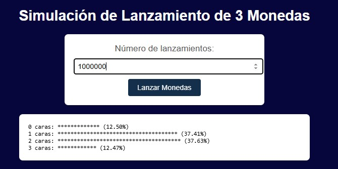

# Simulación de Lanzamiento de Monedas

Este proyecto es una simulación que permite al usuario ingresar el número de lanzamientos de 3 monedas. El resultado se muestra en un histograma simple representado con asteriscos, donde cada asterisco representa el 1% del total de lanzamientos.

## Estructura del Proyecto

El proyecto tiene la siguiente estructura de directorios:


## Archivos del Proyecto

- **index.html**: Archivo principal HTML que define la estructura de la página.
- **styles.css**: Archivo de estilos CSS que da formato a la página.
- **script.js**: Archivo JavaScript que maneja la lógica de la simulación y la generación del histograma.

## Instrucciones para Ejecutar

1. **Clona el repositorio** (si es necesario):
   ```bash
   git clone <URL_DEL_REPOSITORIO>
   cd <DIRECTORIO_DEL_PROYECTO>

## Ejemplo de Salida

A continuación se muestra un ejemplo de salida del histograma generado por la aplicación:


